# 아이티윌 프로젝트 2팀

## 프로젝트 소개 - Sellity

- Sellity는 B2B 물류 거래 자동화 서비스입니다.
- 기업의 보유하고 있는 물품의 재고를 보다 효율적으로 관리할 수 있습니다.
- 다른 기업의 다양한 물품을 조회하고 자유롭게 거래할 수 있습니다.
- 복잡하지 않아, 빠르게 서비스를 이용할 수 있습니다.

- 프로젝트 개발 기간: 2025-03-19 ~ 2025-04-22

<br>

  [Sellity 바로가기](http://34.168.32.224:8080/web/main)

<br>

## 팀원 목록

- 팀장 : 김범호 
- 팀원 : 김수빈
- 팀원 : 남정민
- 팀원 : 오예림

## 역할 분담

### 김범호

- 대시보드 페이지 설계 & 템플릿 제작
- 대시보드 내 스크롤 방식 구현 (페이지 기반 -> 테이블 기반)
- 프로젝트 내 공용 스타일 및 리소스 제작
- 로그인 및 회원가입 로직 구현
- 아이디 찾기 및 비밀번호 찾기 로직 구현
- 이메일 인증 기능 구현 (OAuth, Gmail API 사용)
- 이메일 인증 관련 인증번호 템플릿 페이지 제작
- MyBatis를 이용한 DB 상호작용 구현
- 프로젝트 내 파일 업로드 시스템 구현 (GCS API 사용)
- 프로필 이미지 변경 시스템 구현 (GCS API 사용)
- 상품 목록 페이지 제작 및 로직 구현
- 상품 등록 페이지 로직 구현
- 배포 서버 연동 (CI/CD)
- 프로젝트 총괄

### 김수빈

- 관리자 페이지 UI 구성 및 템플릿 구조 정리(물품 관리, 회원 관리, 알림 전송/리스트 페이지 등)
- 관리자 페이지 물품 관리 기능 구현(수량 수정, 상태 변경 등 JSON 기반 기능 포함)
- 기업 상세 정보 모달창 UI 및 DB 연동 구현
- 회원가입 페이지 UI 및 JavaScript 유효성 검사 로직 구현
- 마이페이지 UI 및 사용자 정보 출력 기능 구현
- 마이페이지 정보 및 프로필 사진 수정 기능 구현 (Google Cloud Storage 연동 포함)
- 정산 현황 페이지 UI 제작
- 메인페이지 사이드바 메뉴 네비게이션 구현

### 남정민

- 관리자 페이지 기능 및 로직 구현
- 카카오 결제 기능 구현 (Kakao API 사용)
- 입고 현황 페이지 로직 구현
- 출고 현황 페이지 로직 구현
- 견적 현황 페이지 로직 구현
- 정산 현황 페이지 로직 구현
- 알림 페이지 기능 및 로직 구현
- 상점 페이지 기능 및 로직 구현

### 오예림

- JavaScript, JSP, Tailwind CSS를 기반으로 UI를 구현
- 메인 로그인 화면, 회원가입, 아이디/비밀번호 찾기, 회원탈퇴, Shop 페이지 등 주요 UI 화면을 설계 및 제작
- AJAX 기반 이메일 인증 로직을 구현하여 사용자 아이디 조회 기능 완성
- 프로젝트 전반의 프론트엔드 UI 통일
- 일관된 사용자 경험(UX) 제공
- 상품 등록을 위한 전용 UI 화면을 기획 및 제작
- 메인 및 로그인 화면 중심으로 핵심 사용자 진입 동선 설계 및 UI 구현
- 브랜드 아이덴티티를 반영하여 색상, 폰트, 로고, 레이아웃 등의 시각 요소를 통일성 있게 설계

<br>

## ⚙️ 개발 환경

<table>
      <thead align="center">
        <tr>
          <th colspan="4" style="text-align:center;"><span style="font-size:16px;">프론트엔드</span></th>
          <th style="text-align:center;"><span style="font-size:16px">백엔드</span></th>
          <th style="text-align:center;"><span style="font-size:16px">서버</span></th>
          <th colspan="2" style="text-align:center;"><span style="font-size:16px;">DB</span></th>
        </tr>
      </thead>
      <tbody>
        <tr>
          <td align="center" style="text-align:center;">
            <a href="https://reactjs.org/" target="_blank"></a>
            <br>
            <code>TailWindCSS</code>
          </td>
          <td align="center" style="text-align:center; margin: 0 auto;">
            <a href="https://styled-components.com/" target="_blank"></a>
            <br>
            <code>HTML5</code>
          </td>
          <td align="center" style="text-align:center; margin: 0 auto;">
            <a href="https://styled-components.com/" target="_blank"></a>
            <br>
            <code>JavaScript</code>
          </td>
          <td align="center" style="text-align:center; margin: 0 auto;">
            <a href="https://styled-components.com/" target="_blank"></a>
            <br>
            <code>AJAX</code>
          </td>
          <td align="center" style="text-align:center; margin: 0 auto;">
            <a href="https://styled-components.com/" target="_blank"></a>
            <br>
            <code>Spring 3</code>
          </td>
          <td align="center" style="text-align:center; margin: 0 auto;">
            <a href="https://styled-components.com/" target="_blank"></a>
            <br>
            <code>Tomcat 9</code>
          </td>
<td align="center" style="text-align:center; margin: 0 auto;">
            <a href="https://styled-components.com/" target="_blank"></a>
            <br>
            <code>MySQL</code>
          </td>
</table>

<br>

## 🤝 협업 방식</a>

1. 디스코드로 소통하여 필요한 부분에 대해 의논합니다.
2. 해당하는 부분에 대한 브랜치를 생성하여 작업합니다.
3. 기능 구현 단위로 commit을 진행합니다.
4. 작업 도중 완료된 부분에 대해 **PR(Pull Request)** 을 생성합니다.
- Commit, PR, Issues가 발생하면 다른 팀원들이 확인할 수 있도록 디스코드 봇이 관련 채널로 메시지를 보내게 하여 팀원이 모두 알 수 있게 했습니다.
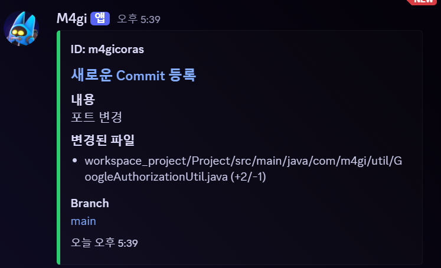

5. 팀장이 해당 PR에 대해 확인하고 충돌이 나는 부분이 있는지, 없다면 dev 브랜치에 병합하여 작업을 반영합니다.
6. 작업이 끝난 부분에 대해 main 브랜치에 병합하여 외부 서버에서 정상 작동 유무를 확인합니다.
    

## 🔀 브랜치 전략

- 프로젝트 기간 동안 팀원들이 모두 각기 다른 작업을 진행하기 때문에 작업 별로 브랜치를 나누고 dev 브랜치에 병합한 뒤, 문제가 없는 부분에 대해서는 main 브랜치에 병합하도록 진행했습니다.

<br>

## 📐 컨벤션

팀원 간의 원활한 소통과 협업을 위해 프로젝트 내에서 사용할 컨벤션을 정의했습니다.

### [🔗 브랜치 컨벤션](https://github.com/nailedReact/bokgungom-market/wiki/%F0%9F%93%A8-%EC%BB%A4%EB%B0%8B-%EC%BB%A8%EB%B2%A4%EC%85%98)

- 브랜치 명을 본인 이니셜로 작성하여 어떤 작업중인지 알 수 없어, 프로젝트 내에 다음과 같은 컨벤션을 따르도록 했습니다.

    ```
        - 브랜치는 영어로 작성하며, dev_로 시작합니다.
        - 반드시 대략적인 기능을 포함하도록 했습니다. (dev_product)
        - 선택에 따라 브랜치 이름 마지막 부분에 본인 식별자를 했습니다. (dev_product_oyl)
    ```

<br>

### [🔗 코드 컨벤션]
- 프로젝트 내에서 사용할 코드 컨벤션을 정의했습니다.

    ```
        - 클래스명은 PascalCase, 메서드명은 camelCase으로 작성합니다.
        - 변수 및 상수는 반드시 의미가 있고, 의미를 알 수 있는 이름으로 작성합니다.
        - 연산자와 피연산자 사이에는 항상 1칸의 공백을 삽입합니다.
        - 메서드 호출 시, 매개변수 사이에는 항상 1칸의 공백을 삽입합니다.
        - 생성한 클래스, 메소드에는 주석으로 설명을 표시합니다.
        - Test 클래스일 경우, 클래스 이름은 반드시 마지막에 Test가 붙도록 작성합니다.
    ```

## 페이지 미리보기

<table width="100%">
<tr>
    <th colspan="1">메인 페이지</th>
</tr>

<tr align="center">
    <td valign="top" width="100%">
      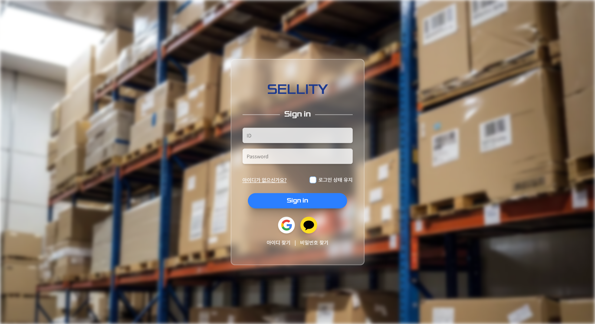
    </td>
</tr>
</table>

<table>
  <tr>
    <th colspan="2">아이디 찾기 페이지</th>
  </tr>
  <tr style="text-align:center;">
    <td style="vertical-align:top; width:50%;">
      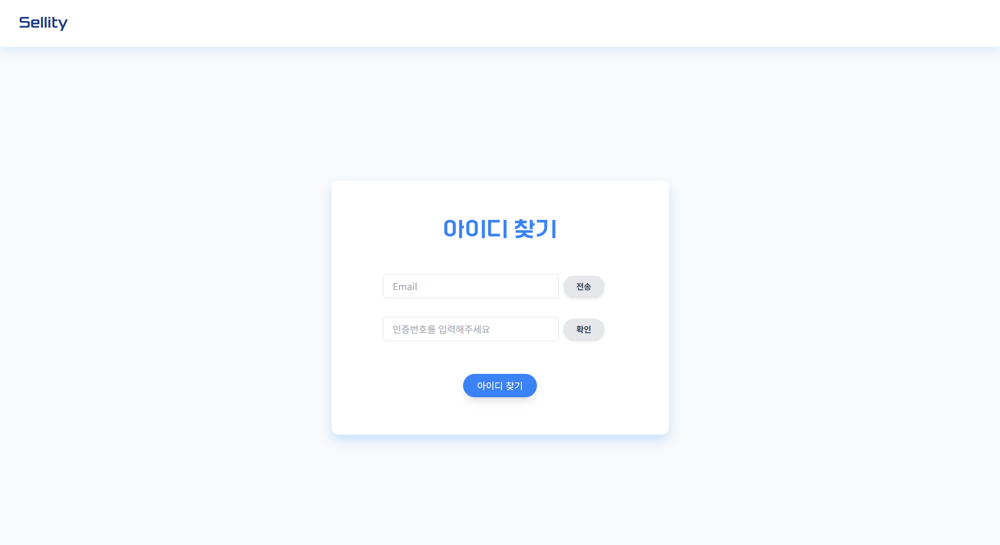
    </td>
    <td style="vertical-align:top; width:50%;">
      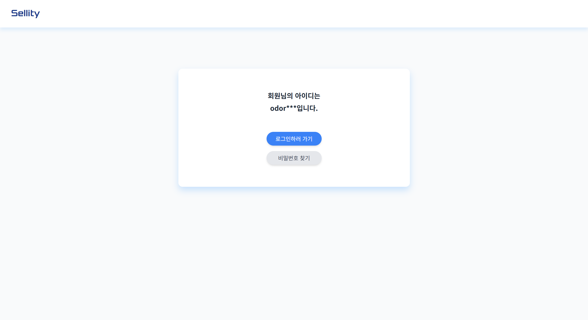
    </td>
  </tr>
</table>

<table>
  <tr>
    <th colspan="2">비밀번호 찾기 페이지</th>
  </tr>
  <tr style="text-align:center;">
    <td style="vertical-align:top; width:50%;">
      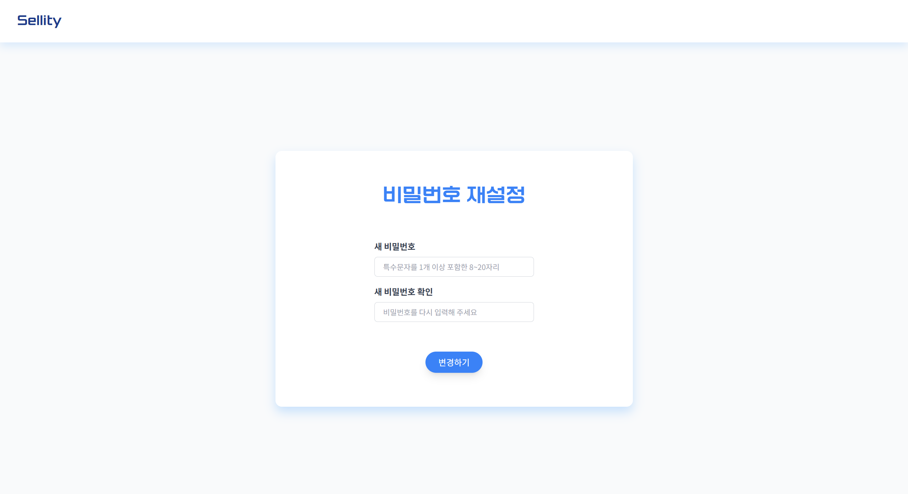
    </td>
    <td style="vertical-align:top; width:50%;">
      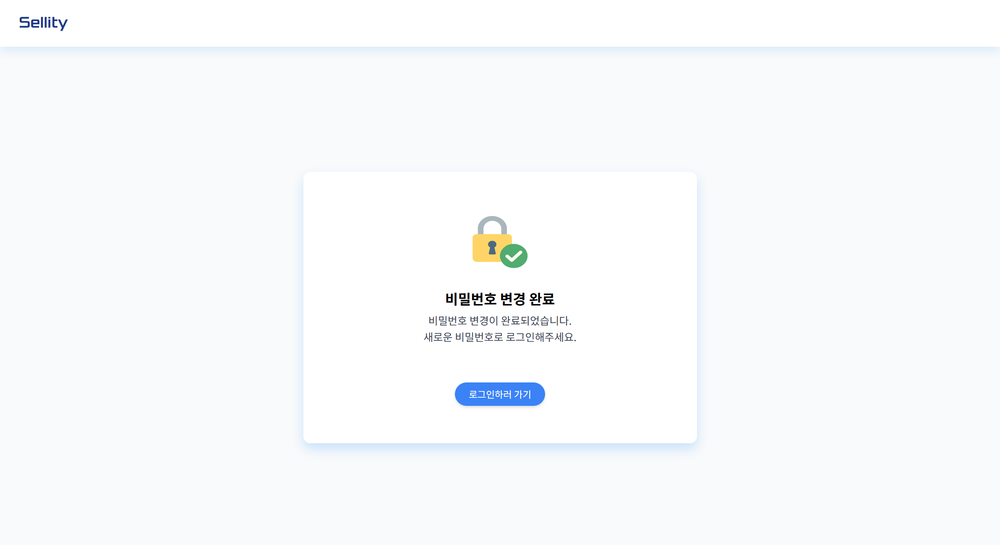
    </td>
  </tr>
</table>

<table>
  <tr>
    <th colspan="1">회원가입 페이지</th>
  </tr>
  <tr style="text-align:center;">
    <td style="vertical-align:top; width:100%;">
      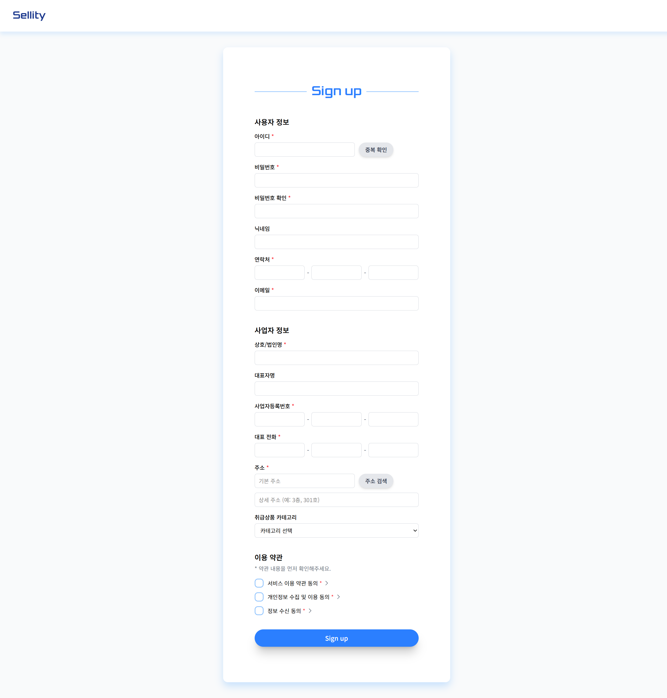
    </td>
  </tr>
</table>

<table>
  <tr>
    <th colspan="2">상품 목록/등록 페이지</th>
  </tr>
  <tr style="text-align:center;">
    <td style="vertical-align:top; width:50%;">
      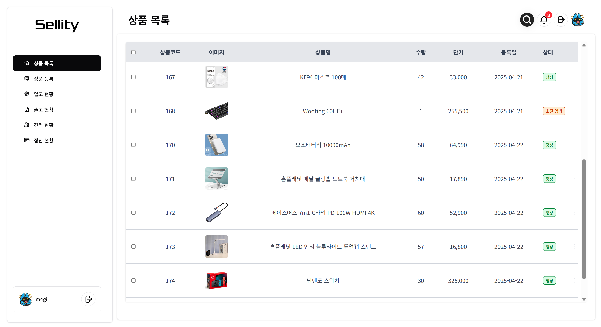
    </td>
    <td style="vertical-align:top; width:50%;">
      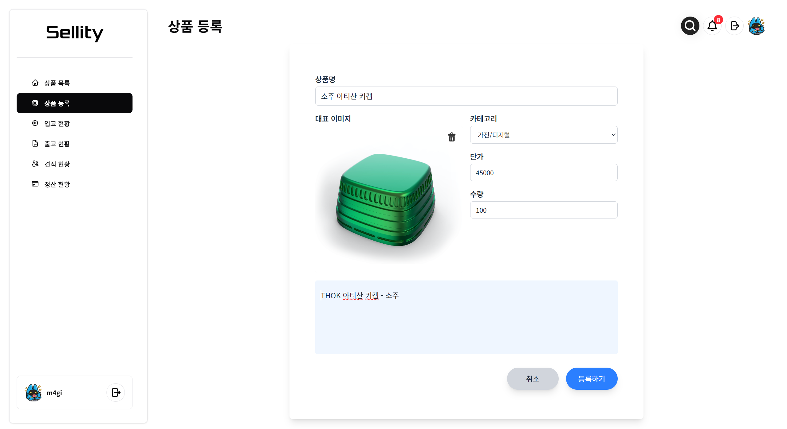
    </td>
  </tr>
</table>

<table>
  <tr>
    <th colspan="2">입고/출고 현황 페이지</th>
  </tr>
  <tr style="text-align:center;">
    <td style="vertical-align:top; width:50%;">
      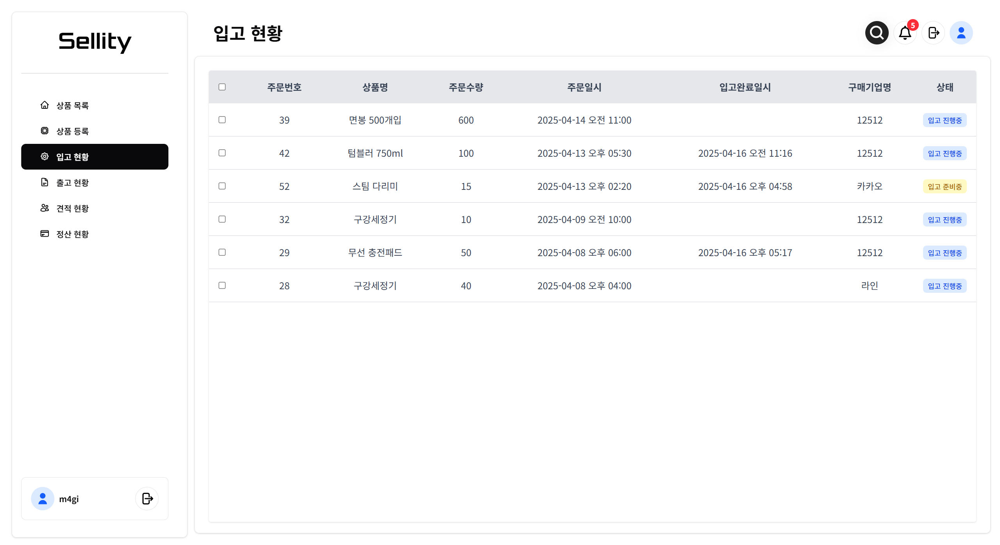
    </td>
    <td style="vertical-align:top; width:50%;">
      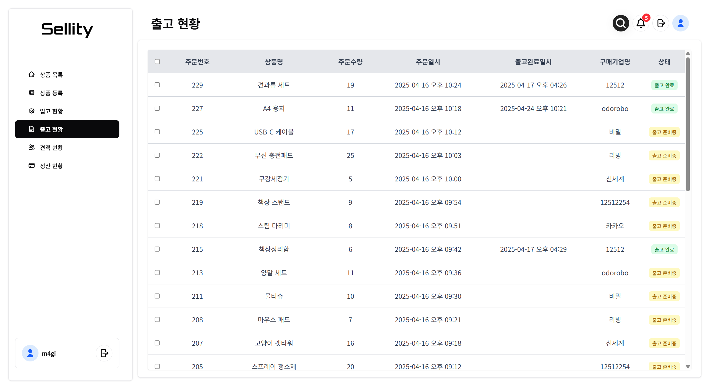
    </td>
  </tr>
</table>

<table>
  <tr>
    <th colspan="3">견적/정산 현황, 결제 페이지</th>
  </tr>
  <tr style="text-align:center;">
    <td style="vertical-align:top; width:40%;">
      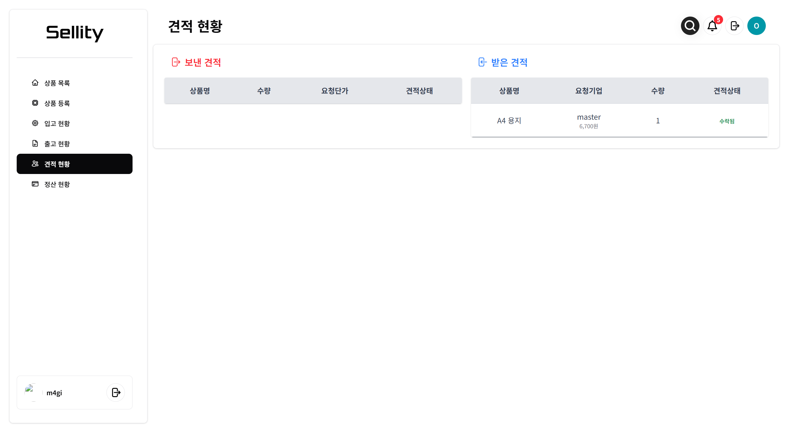
    </td>
    <td style="vertical-align:top; width:40%;">
      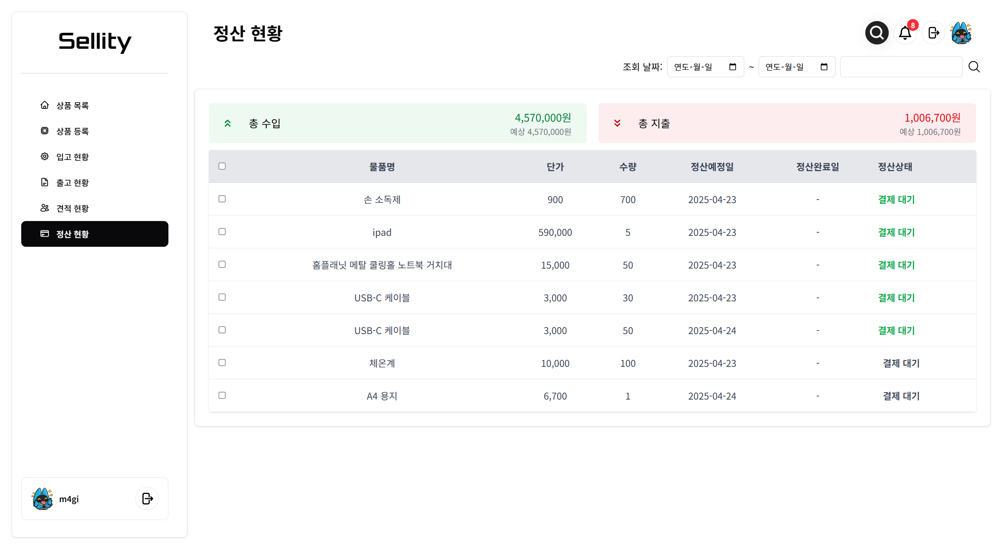
    </td>
    <td style="vertical-align:top; width:20%;">
      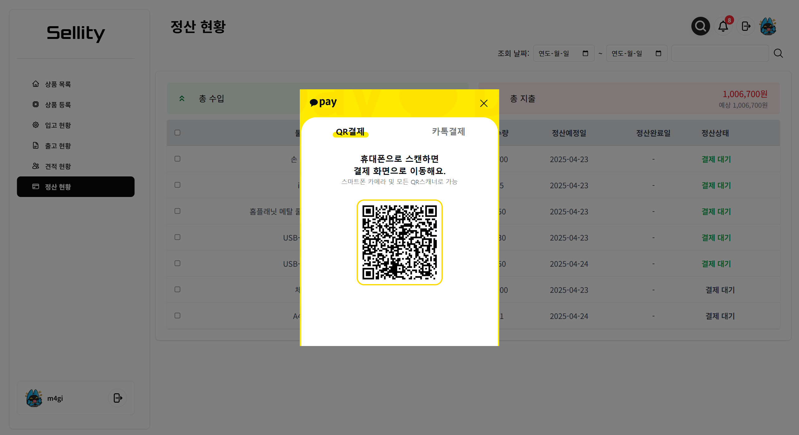
    </td>
  </tr>
</table>

<table>
  <tr>
    <th colspan="2">알림 페이지</th>
  </tr>
  <tr style="text-align:center;">
    <td style="vertical-align:top; width:50%;">
      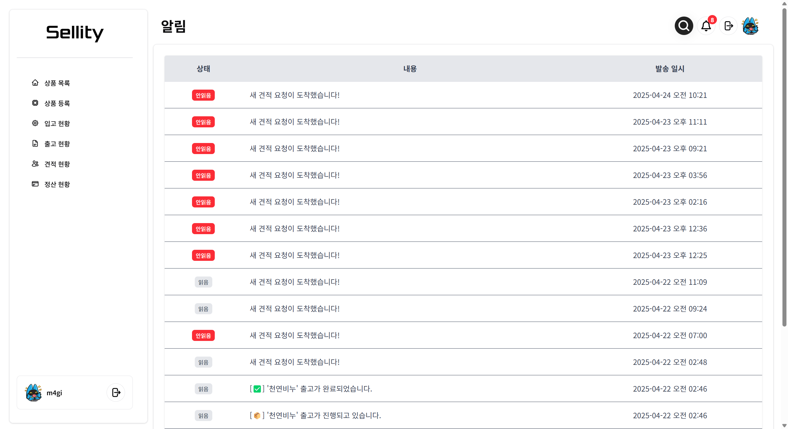
    </td>
    <td style="vertical-align:top; width:50%;">
      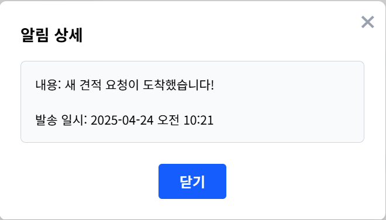
    </td>
  </tr>
</table>

<table>
  <tr>
    <th colspan="2">상점 페이지</th>
  </tr>
  <tr style="text-align:center;">
    <td style="vertical-align:top; width:50%;">
      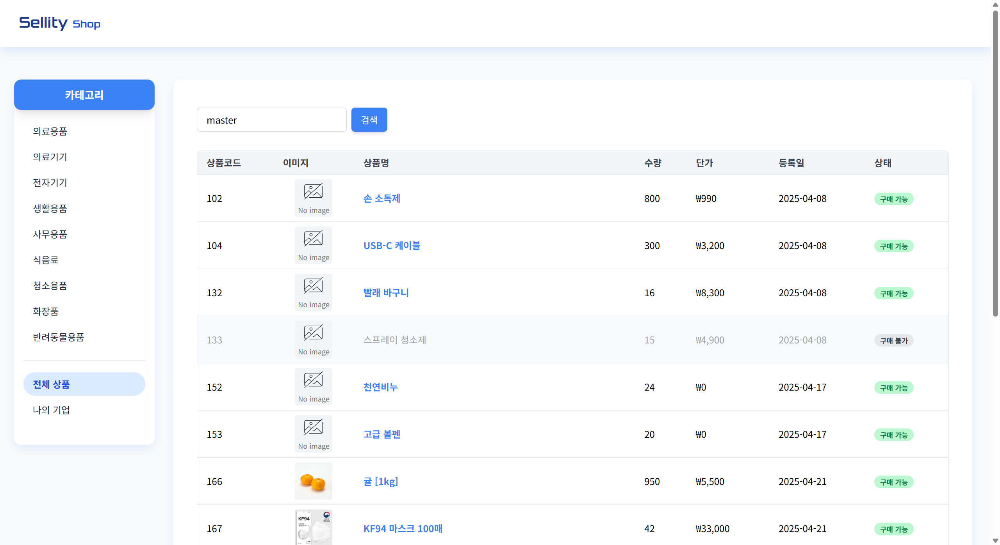
    </td>
    <td style="vertical-align:top; width:50%;">
      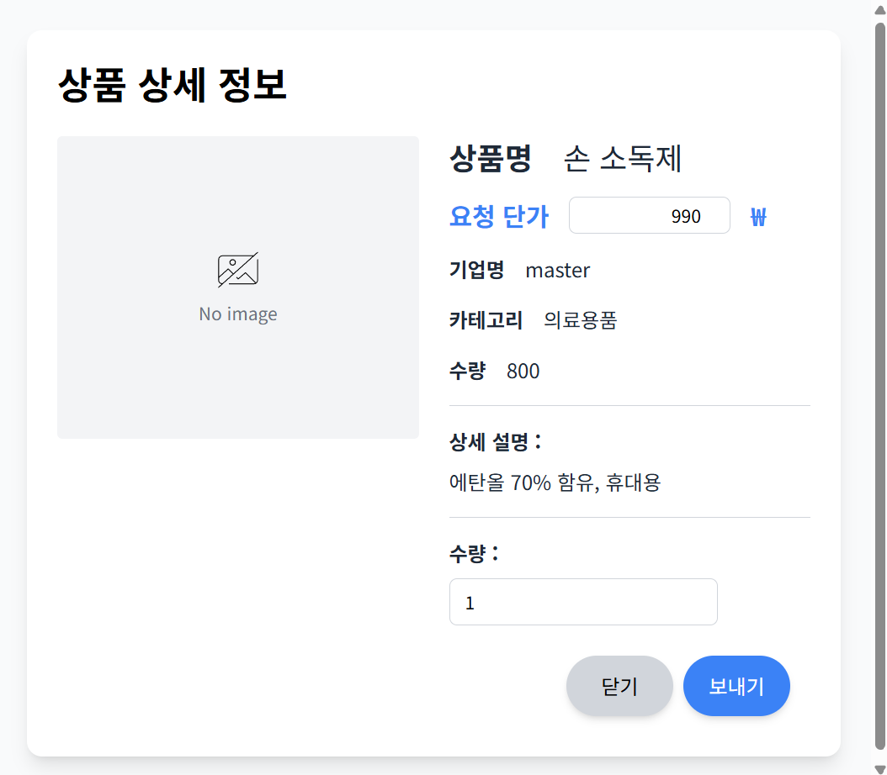
    </td>
  </tr>
</table>

<br>


